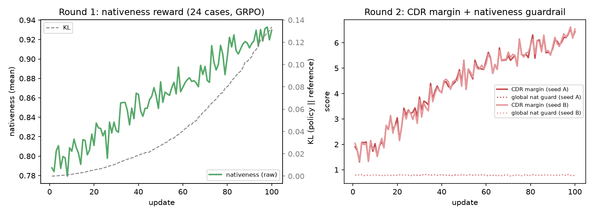
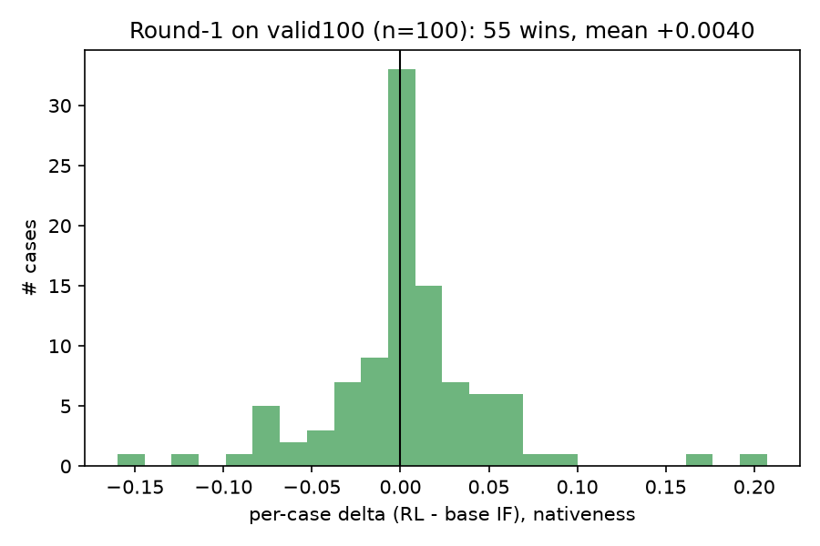
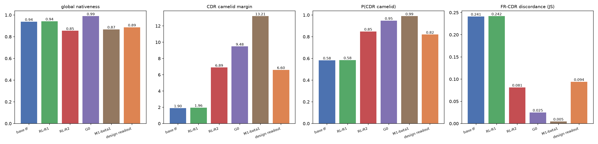
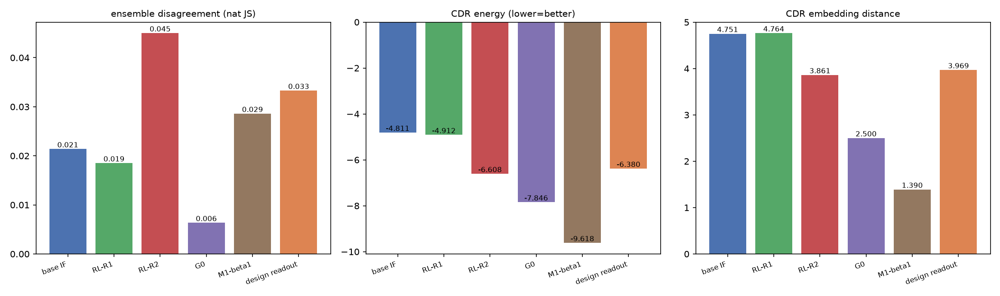
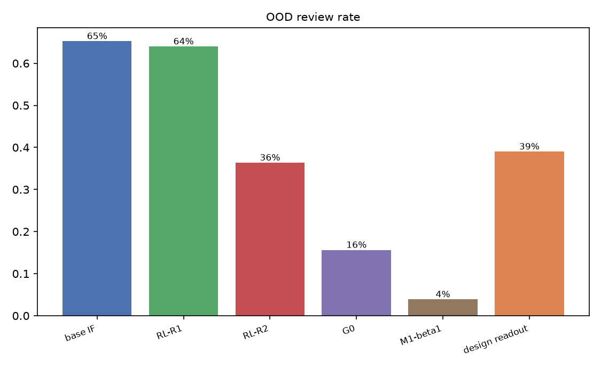
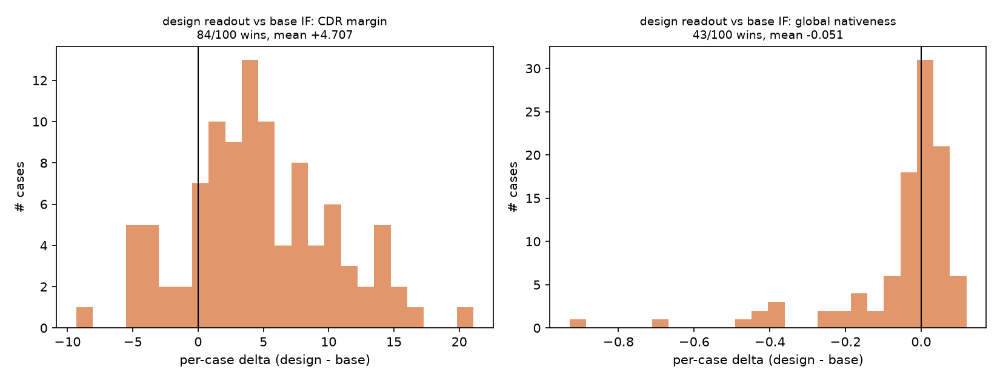
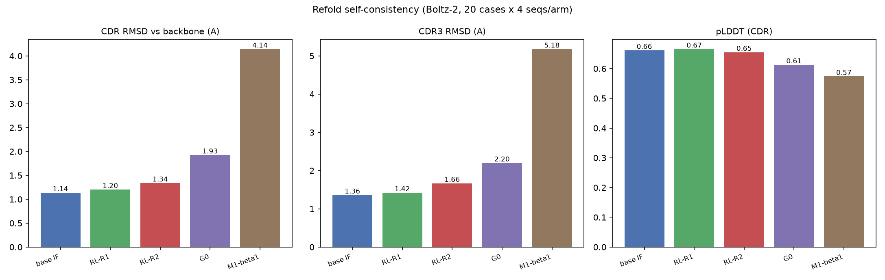
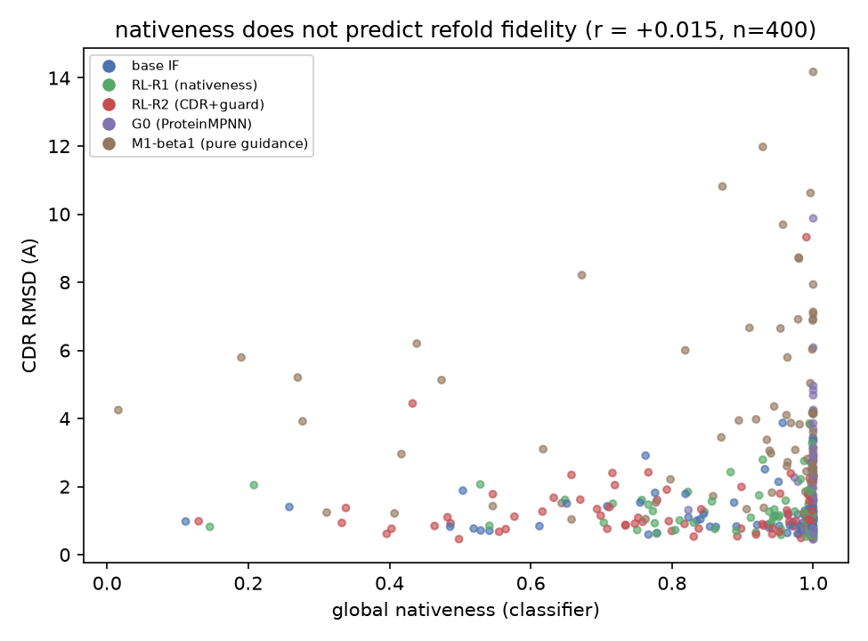

# VHH 逆折叠在线 RL：组会汇报

> 文档：`vhh_boltzgen_rl/docs/GROUP_MEETING_RL_REPORT.md`
> 图目录：`vhh_boltzgen_rl/docs/round1_figures/`
> 数据：`vhh_boltzgen_rl/runs/round1_rl_split/`（全部评测原始CSV/JSONL）

---

## 0. 一句话总结

在 BoltzGen 逆折叠模型上搭起了完整的在线 RL（GRPO）闭环并逐 Gate 验证；
两轮 reward 迭代证明了**训练机器可靠、KL约束能防 hack、分类器类 reward 会"刷分不涨本事"**——
refold 自洽评测显示 nativeness/CDR 分类器得分与结构保真度**不相关（r≈0）**；
且 BoltzGen design 扩散步自带的序列读出已与 RL-R2 同档（"免费基线"），
下一轮 reward 必须换成结构/功能指标。

---

## 1. 要回答的问题

1. BoltzGen IF（`InverseFoldingDecoder`）的逐残基 log-prob 能否精确拿到？
2. 固定 FR、只对 CDR 产生 policy gradient，是否可行且稳定？
3. 外部黑盒 scorer 能否真实改变 IF 采样分布（在线 RL 是否 work）？
4. RL 出来的序列在**未见过**的结构/评测集上是否优于原始 IF？

---

## 2. 方法

```
冻结 encoder (s,z,edges) ──► rollout（逐行复刻官方 sample()）
        ▲                        │ 记录每步 action + logprob
        │                        ▼
   replay teacher-forcing ◄── trajectory
        │                        │
        ▼                        ▼
   policy带梯度/reference冻结 外部scorer（vhh_guidance VHH-source ensemble）
        │                        │
        └── GRPO(rank) + KL ─────┘
            仅解冻 decoder；FR hard assert (§19)
```

**Gate 验证链（全部通过）**

| Gate | 检查项 | 结果 |
|---|---|---|
| 审计 | repo 版本/模型结构/canonical token序 | 与参考 commit 一致 |
| 单元测试 | advantage / KL | 7/7 |
| 采样 parity | rollout vs 官方 `sample()` | 10 seeds 全 match |
| replay parity | 同轨迹 logprob 复算 | max diff **6.8e-6** ≤ 1e-5 |
| 梯度 | 传播到 decoder、encoder/reference 冻结 | PASS |
| toy reward | REINFORCE / GRPO 学 target AA | 0→0.10，KL≤0.23 |
| scorer overfit | 单 case 过拟合真实 scorer | 0.760→0.977 |

---

## 3. Round 1：nativeness reward

**设置**：24 train cases（SAbDab2 晶体 VHH，MMseqs70 聚类簇级划分，与 valid100 零重叠），
reward = 全局 nativeness 概率，GRPO(rank)，K=8，100 updates，KL β=0.01。



**训练**：nativeness 0.797→0.91（+0.11），KL 0.10 有界，unique rate 1.00，FR 零突变。

**评测**

| 测试集 | 样本 | RL vs base | 胜率 | 结论 |
|---|---|---|---|---|
| sabdab2 held-out（8 case） | 8×8 | **+0.016** | 5/8 | 正向但不显著 |
| valid100（100 case） | 100×8 | +0.004 | 55/100 | Wilcoxon p=0.20，**不显著** |
| ↳ 难 case（base<0.9，n=22） | | **+0.038** | 15/22 | 增益集中在难 case |
| ↳ 易 case（base≥0.9，n=78） | | −0.006 | 40/78 | 天花板效应 |



**发现**：base IF 在 valid100 上 nativeness 已达 0.938，reward 量程见顶；
RL 只填了约 7% 的可用 gap（相对 G0）。

---

## 4. Round 2：CDR margin 主 reward + nativeness 护栏

**动机**：分析五臂发现 CDR 专项分才有 headroom（base 1.9 vs G0 9.5 vs M1 13.2），
但全局分会被刷坏（M1-β1 教训）。因此：

```
opt = cdr_camelid_margin − λ · max(0, floor_case − nativeness)
λ = 5.0；floor_case = 该 case base 均值 − 0.05（32 case 全部预先 baseline）
```

**训练**（双 seed，各 100 updates，2 卡并行）


- CDR margin：1.82→**6.35**（s1）/ 1.84→**6.36**（s2），双 seed 几乎重合
- 护栏 nat 全程稳定 0.78–0.79（floor 均值 0.74），viol 率不扩大
- KL 0.11，unique 1.00 —— **未复刻 M1-β1 式的全局塌陷**

**valid100 评测**

| 指标 | base IF | RL-R1 | **RL-R2** | G0 (MPNN) | M1-β1 | **design 读出** |
|---|---|---|---|---|---|---|
| CDR camelid margin | 1.90 | 1.96 | **6.89** | 9.48 | 13.21 | **6.60** |
| P(CDR camelid) | 0.583 | 0.585 | **0.849** | 0.948 | 0.990 | **0.820** |
| FR-CDR discordance | 0.241 | 0.242 | **0.082** | 0.025 | 0.005 | **0.094** |
| CDR energy↓ | −4.81 | −4.91 | **−6.61** | −7.85 | −9.62 | **−6.38** |
| 全局 nativeness | 0.938 | 0.942 | **0.855** | 0.990 | 0.868 | **0.887** |
| ensemble 分歧 | 0.021 | 0.019 | 0.045 | 0.006 | 0.029 | 0.033 |
| OOD review 率 | 522/800 | 512/800 | 291/800 | 125/800 | 31/800 | 39/100 |

> R2 单 case 均值 +0.080 (s1) / +0.020 (s2)，胜率 53/100、50/100——**注意这里的"提升"只针对 reward 本身**。

**新增对照——design 读出臂**：BoltzGen design 步（atom14 全原子扩散）会把自己生成的结构
经几何解码（`res_from_atom14`：侧链原子最近骨架原子的计数查表）读出一套序列，写在
backbone.cif 里。这是一条此前没被评过的"免费"基线（随 backbone 生成附带）。提取校验：
100/100 FR 与 manifest 一致、100/100 与 IF 实际消费的 `design.cif` 一致。
逐 case 对比 base IF：**CDR margin 84/100 胜（+4.71）**、全局 nat 43/100 胜（−0.051）。
即设计模型自带的读出与 RL-R2 同一档（RL 在 CDR margin 6.89 vs 6.60、discordance 0.082 vs 0.094 上小胜），
但同样打不过 G0。






**三个问题**：
1. 护栏的 floor 是训练集上的**绝对值**，在测试集（base 本身 0.94）上够不着——训练守住了，测试没守住；
2. reward 的确涨了，但这个"涨"有没有意义？→ 见 Refold；
3. design 读出证明扩散模型自带序列的质量已介于 base 与 G0 之间——RL 的训练价值需要与这条免费基线比较。

---

## 5. Refold 自洽评测（关键实验）

用 Boltz-2（`boltz2_conf_final.ckpt`，200 步）对五臂序列做 fold-back
（20 cases × 5 臂 × 4 条 = 400/400 成功），CDR RMSD vs 原 backbone：

| 臂 | 全局 nativeness | **CDR RMSD↓** | CDR3 RMSD | pLDDT(CDR) |
|---|---|---|---|---|
| base IF | 0.938 | **1.14** | 1.36 | 0.66 |
| RL-R1 | 0.942 | 1.20 | 1.42 | 0.67 |
| RL-R2 | 0.855 | 1.34 | 1.66 | 0.65 |
| G0 (ProteinMPNN) | **0.990** | 1.93 | 2.20 | 0.61 |
| M1-β1 (纯 guidance) | 0.868 | **4.14** | 5.18 | 0.57 |



**相关性**（400 条序列，跨全部五臂）：

```
corr(nativeness, CDR RMSD) = +0.015   ≈ 0
（各臂内部：-0.09 ~ +0.07，全部不显著）
```



**结论**：
- 分类器分数与结构保真度**不相关**；排名甚至反了（最"天然"的 G0 折得最差）
- 纯 guidance 的 M1-β1 在结构层面是灾难（4.14Å）——分类器可被刷分实锤
- 我们的 RL-R2 用 margin reward 换来 0.2Å 的 RMSD 退化——reward 选错了

> design 读出臂未做 refold：该序列本身就是从同一份全原子结构几何解码出来的，
> fold-back 有天然的 circular 优势，与其它臂不可比。

---

## 6. 结论

| 问题 | 答案 |
|---|---|
| log-prob 精确获取 | ✅ replay parity 6.8e-6 |
| FR 固定 + CDR 梯度 | ✅ 全程零 FR 突变 |
| 黑盒 scorer 能改变分布 | ✅ toy / overfit / 两轮真实 reward 全部上升 |
| 泛化优于原始 IF | ⚠️ nativeness 定义下勉强（难 case +0.038，整体不显著）；refold 定义下**没有** |

**核心教训**：RL 训练机器是可靠的（parity/KL/护栏/双 seed 复现都验证过），
**瓶颈在 reward**——分类器 proxy 与真实结构质量脱钩，继续刷分没有意义。
且 diffusion design 步自带的序列读出已与 RL-R2 同档，进一步说明在 nativeness 轴上
"训练出来的提升"大部分是免费的。

## 7. 下一步

1. **reward 换成结构指标**：refold RMSD 太贵（在线不可用）→ best-of-N 重排 或 蒸馏轻量 proxy
2. **亲和力通道修复**：预训练 head 的 coordinate_swap 未通过（坐标通道失效），修好后接在线 RL
3. **方法学收尾（可选）**：R2 的护栏改为相对式（margin + α·nat）跑一版作对照

---

*附：所有 Gate 审计日志在 `VHHdata/audit_logs/`，代码在 `vhh_boltzgen_rl/`，随机种子与 checkpoint 均已落盘。*
