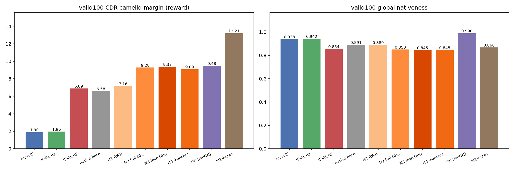
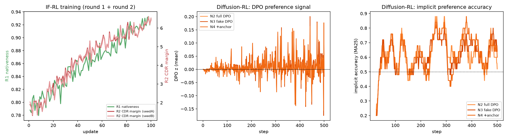
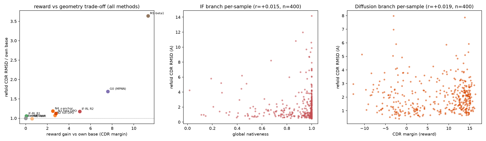

# VHH CDR 设计项目：RL 后训练（IF 路线 + 扩散路线）

任务是在给定 VHH 框架区（FR）和 CDR1、CDR2、CDR3 长度的条件下，重新设计 CDR 序列。
前文已建立 G0（ProteinMPNN 基线）、M1（逐位概率融合）、M2（局部精修）、M3（坐标梯度引导）
四条引用路线。本文汇报之后的**两条强化学习后训练路线**：

- **IF-RL**：对 BoltzGen 内部的逆折叠解码器做在线 RL（第一轮 nativeness、第二轮 CDR 专项）；
- **扩散-RL**：对 BoltzGen **原生 atom14 设计扩散模型**做离线偏好优化（RWR / 扩散-DPO 系列）。

两条路线共用同一套数据划分、同一个 CDR 分类器打分标准，因此最终可以放在同一张表里比较。

---

## 1. 本文涉及的对象

| 对象 | 作用 |
|---|---|
| BoltzGen 逆折叠解码器（IF） | 固定设计骨架，逐位生成 20 种氨基酸概率；作为 IF-RL 的策略 |
| BoltzGen 原生 atom14 设计扩散 | 直接生成全原子几何；序列由官方 `res_from_atom14` 从几何读出（没有独立序列头） |
| VHH 分类器 | 完整序列评分器；**唯一的训练 reward**（CDR margin），同时用作独立评价 |
| ProteinMPNN（G0）/ M1-β1 | 历史方法，作为对照基线 |

---

## 2. 数据怎么来

1. **原料**：SAbDab2 晶体库（10,280 个抗体结构）→ 提取**单链 VHH**（110–135 aa、含 J 区
   基序、无轻链配对）→ 共 **9,547 条链**。
2. **去重与隔离**：MMseqs2 70% 相似度聚类 → **382 个簇**；与最终测试集 valid100 做
   同源泄漏检查（≥85% 相似即排除 13 条）。
3. **划分**（簇级，训练/测试零重叠）：

| split | 数量 | 用途 |
|---|---|---|
| train | 24 个簇 | 生成训练样本、更新参数 |
| held-out | 8 个簇 | 开发期评测、选 checkpoint |
| valid100 | 100 个 case | **最终评测，全程不参与调参** |

4. **样本量**：IF-RL 每个 case 在线采 8 条序列；扩散-RL 离线生成
   train 24×32=768 条、held-out 8×8、valid100 100×8，并配出 **192 对** preference。

---

## 3. 两条路线的设计（大白话）

### 3.1 IF-RL 第一轮：让序列"更像天然 VHH"

逆折叠解码器的输出天然是"逐位 20 种氨基酸的概率"，可以把每设计一位就当成一步动作，
直接用 RL。做法：同一个 case 采 8 条序列 → 分类器给每条打分（这里用全局 nativeness）
→ 组内排名，分数高的序列概率拉高、低的压低（GRPO）；同时用 KL 约束拴住原模型，
FR 位置硬锁死不许变。100 步训练后：训练分数 0.797→0.91。

### 3.2 IF-RL 第二轮：只盯 CDR，同时加护栏

第一轮发现全局分在易 case 上已经到顶。第二轮把 reward 换成分类器的 **CDR 专项分**
（cdr_camelid_margin），并加一条"护栏"：如果全局 nativeness 掉到 case 基线以下
就扣分。双 seed 各 100 步：CDR 分 1.8→6.4，全局分守住 0.78–0.79。

### 3.3 扩散-RL 公共设置：不碰采样器，只调打分器

原生设计扩散一次生成的是**整个结构**，序列是从几何里"读"出来的，没法直接算序列
log-prob，所以换成**离线偏好优化**：先用原模型批量生成（N0 池），用分类器打分，
再拿好/差样本对去微调**去噪打分网络**（其余部分全部冻结）。关键细节：

- 每对赢家/输家**共享同一个噪声强度、同一串随机噪声、同一次随机旋转平移**——
  保证差异只来自样本本身，而不是运气；
- 训练时同时看**当前模型**和一份**冻结的原始模型副本**：只有当前模型"更喜欢赢家"
  的相对程度超过副本时才算进步（防止整体放水）；
- 只在 CDR 位置施加偏好，其余原子用牵引绳拴住（见 N4）。

### 3.4 四个 arm 的区别

| arm | 方法 | 大白话 |
|---|---|---|
| N1 | RWR | 每个 case 只挑分数最高的 25%（32 条里的 8 条），用官方去噪目标继续练——"背好作业" |
| N2 | Full-Atom14 DPO | 偏好作用在 **CDR 全部原子**（骨架+侧链） |
| N3 | CDR-Fake-Atom DPO | 偏好只作用在 **CDR 的 fake 侧链槽位**——真正"写着氨基酸身份"的那部分几何 |
| N4 | N3 + anchor | 在 N3 基础上，对非偏好原子（FR、CDR 骨架）加"牵引绳"：训练后输出不许离原始副本太远 |

DPO 的实现与标准扩散-DPO 同方向：
`z = -β/2·[(当前模型赢家损失−输家损失) − (副本赢家损失−输家损失)]`，`L=-logσ(z)`；
初始化时当前=副本，损失恰好等于 log2≈0.693（实测 0.69314718）。

---

## 4. 评价指标

| 指标 | 计算方式 | 方向 |
|---|---|---|
| **CDR 分类器 margin** | 完整序列送 VHH 分类器，CDR 区"天然类得分 − 非天然类得分" | 越高越好（主指标/reward） |
| 全局 nativeness | 分类器对整条序列的天然概率 | 越高越好（诊断/护栏） |
| FR-CDR discordance | FR 背景分布与 CDR 背景分布的 JS 距离 | 越低越好（诊断） |
| CDR energy / embedding distance | 分类头能量、hidden 向量到天然参考的马氏距离 | 越低越好（诊断） |
| ensemble 分歧 / OOD review 率 | 分类器多模型分歧、越域样本比例 | 越低越好（防刷分） |
| 重折叠 CDR RMSD | Boltz-2 重折叠设计序列，按 FR 对齐后与原设计骨架比 CDR Cα | 越低越好（结构诊断） |
| invalid / UNK 率 | 几何读不出 20 种氨基酸的比例 | 越低越好（硬门槛） |
| FR mismatch | 解码序列 FR 位置与参考不一致的比例 | =0（硬约束） |
| unique rate | 样本去重比例 | 越高越好（防塌缩） |

---

## 5. 结果

### 5.1 IF-RL

| 轮次 | train | valid100（主指标） | 备注 |
|---|---|---|---|
| R1（nativeness） | 0.797→0.91 | nativeness +0.004，55/100 胜 | 增益集中在难 case（+0.038，15/22 胜） |
| R2（CDR+护栏） | CDR margin 1.8→6.4（双 seed） | **CDR margin 1.90→6.89** | 但全局 nativeness 掉到 0.854 |

重折叠（20 cases×4 条）：base IF 1.14 Å → R1 1.20 Å → R2 1.34 Å；
G0 1.93 Å、M1-β1 4.14 Å。**分类器分与重折叠保真度几乎不相关（r=+0.015）**。

### 5.2 扩散-RL

训练（各 500 步）：N1 去噪损失 0.0125；N2/N3/N4 的 DPO 偏好信号 z 分别为
+0.002/+0.009/+0.012，implicit accuracy 0.70，无 NaN、无梯度爆炸。
（β 只做了冒烟校准：0.1/1.0 信号≈0，选 β=10。）

**valid100 主评测（100 case×8 条）**：

| arm | 平均 CDR margin | Δ vs base | 胜/平/负 | Wilcoxon p | 95% CI | invalid |
|---|---|---|---|---|---|---|
| base native | 6.578 | — | — | — | — | 0 |
| N1 RWR | 7.161 | +0.583 | 71/0/29 | 3e-5 | [+0.32,+0.83] | 0 |
| N2 full DPO | 9.279 | +2.702 | 93/0/7 | 2e-17 | [+2.31,+3.11] | 0 |
| **N3 fake DPO** | **9.374** | **+2.796** | **95/0/5** | 4e-17 | [+2.40,+3.20] | 0 |
| N4 fake+anchor | 9.090 | +2.512 | 93/0/7 | 7e-17 | [+2.14,+2.89] | 0 |

诊断面板（同批序列、同一分类器）：

| arm | 全局 nat | FR-CDR discordance | CDR energy | CDR distance | OOD review |
|---|---|---|---|---|---|
| base native | 0.891 | 0.093 | −6.27 | 4.05 | 39.9% |
| N1 | 0.889 | 0.077 | −6.40 | 4.02 | 36.9% |
| N2 | 0.850 | 0.037 | −7.43 | 3.09 | 22.9% |
| N3 | 0.845 | 0.037 | −7.52 | 3.11 | 20.6% |
| N4 | 0.845 | 0.042 | −7.36 | 3.19 | 24.6% |

重折叠（20 valid100 cases，10 难+10 易）：

| arm | CDR RMSD | CDR3 RMSD | FR RMSD | pLDDT(CDR) |
|---|---|---|---|---|
| base native | 1.860 | 2.347 | 0.559 | 0.623 |
| N1 | 1.839 | 2.312 | 0.555 | 0.626 |
| N2 | 1.999 | 2.502 | 0.570 | 0.622 |
| N3 | 2.090 | 2.709 | 0.578 | 0.614 |
| N4 | 2.206 | 2.823 | 0.572 | 0.621 |

### 5.3 合起来看



*左：valid100 CDR margin（reward）；右：全局 nativeness。蓝/绿/红为 IF 路线，灰/橙为扩散路线，
紫/棕为历史基线。*



*左：IF-RL 两轮训练曲线；中：扩散-RL 的 DPO 偏好信号 z；右：implicit accuracy。*



*左：各方法"reward 提升 vs 重折叠 RMSD 相对变化"；中：IF 路线逐样本
（nativeness vs RMSD，r=+0.015）；右：扩散路线逐样本（CDR margin vs RMSD，r=+0.019）。*

**统一排名（同一 valid100、同一 CDR margin）**：

```
M1-β1 13.21（偏科：全局 0.868） > G0 9.48 > N3 9.37 > N2 9.28 > N4 9.09
> IF-RL R2 6.89 ≈ native base 6.58 > IF-RL R1 1.96 > base IF 1.90
```

---

## 6. 结论

1. **两条路线都跑通且可复现**：IF 路线完成了在线 RL 闭环（GRPO + KL + FR 锁定），
   扩散路线完成了离线偏好闭环（RWR + 扩散-DPO），全部工程门槛（解码一致性、配对
   加噪同步、DPO 初始 log2、梯度审计、过拟合测试）通过。
2. **扩散路线是更好的后训练对象**：IF-RL 把其基线从 1.90 拉到 6.89，但天花板明显；
   原生扩散模型天生序列读出已经有 6.58，后训练后 **N3 达到 9.37，基本追平
   ProteinMPNN（9.48）**，把原生生成器的 CDR 天然度补上了关键缺口。
3. **两条路线共同发现：分类器分数与结构保真度几乎无关**（逐样本相关 r=+0.015 和
   +0.019）。分类器只能回答"像不像天然 VHH"，不回答"折得回去吗"。因此**任何以
   classifier 为 reward 的训练都必须并行监控重折叠几何**，否则无法区分真提升和
   刷分。
4. **偏好应施加在"承载序列信息"的几何上**：N3（只调 CDR fake 侧链原子）> N2（全 CDR）
   > N4（N3+牵引绳）在 reward 上依次略降，但 N4 的参数漂移最低。对把氨基酸身份
   编码在原子几何里的生成器，这是比"全原子对齐"更合理的分解方式。
5. **24 个训练 case 已足够泛化**（N3 valid100 95/100 胜）；继续扩到未使用的
   ~340 个干净簇是低成本的下一步。RWR（只学好样本）只能拿到 1/5 的收益，
   说明"对比"比"模仿"重要。
6. **reward 仍不是功能指标**：目前两条路线优化的都是"像天然 VHH"。下一步应接入
   功能性 reward（如修复坐标通道后的亲和力预测头），否则分类器分数上限（M1 的 13.2）
   无法转化为真实的结合能力。

> 附：本报告所有图与表的数据文件在 `runs/native_pool/`（扩散路线）与
> `runs/round1_rl_split/`（IF 路线）；合并图在 `docs/combined_figures/`。
