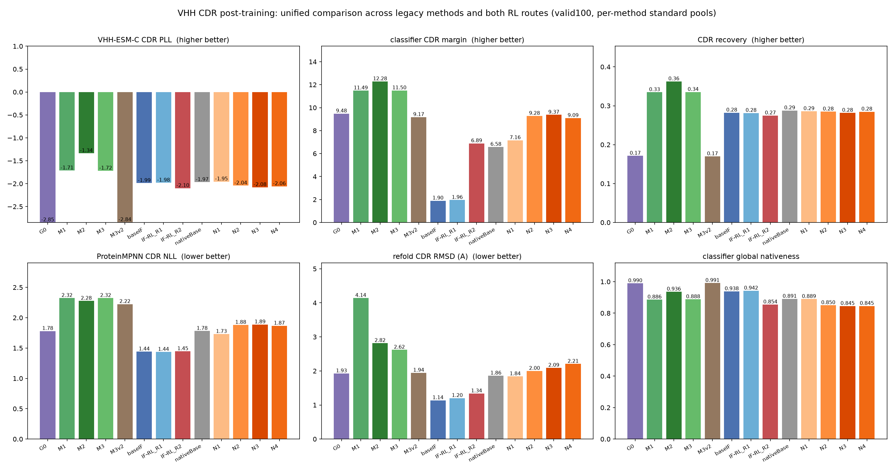
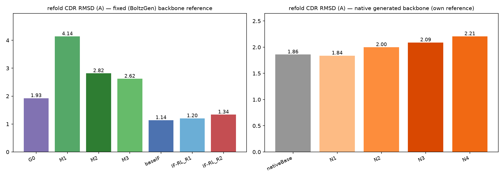

# VHH CDR 后训练统一对比：历史方法（G0/M1/M2/M3）与两条 RL 路线

本文把**历史序列设计方法**（G0、M1、M2、M3、M3-v2）和**本轮两条 RL 后训练路线**
（IF-RL、扩散-RL）放到同一张表、同一批指标下对比。所有数字都来自 valid100
（100 个 case、每个方法 8 条候选/样本），指标口径见 §3。

---

## 1. 方法一览（一句话版）

| 方法 | 一句话 |
|---|---|
| **G0** | ProteinMPNN 基线：在 BoltzGen 固定骨架上采 512 条，按分类器选 top-8 |
| **M1** | ProteinMPNN 逐位生成时融合 VHH-ESM-C 序列概率（β 加权），纯序列方法 |
| **M2** | 从一条 G0 序列出发，按 VHH-ESM-C 不可信度局部重掩码+精修（迭代搜索） |
| **M3** | 第一版坐标引导：把 VHH-ESM-C 序列分数通过梯度作用于 BoltzGen 骨架 |
| **M3-v2** | 干净对照版：奖励回路里去掉 ProteinMPNN，只留 VHH-ESM-C 做坐标引导 |
| **IF-RL R1/R2** | 对 BoltzGen 逆折叠解码器做在线 RL：R1 用全局 nativeness，R2 换 CDR 专项分+护栏 |
| **扩散-RL N1–N4** | 对 BoltzGen 原生 atom14 设计扩散做离线偏好优化（RWR / DPO / fake-atom / +anchor） |

## 2. 数据

- 原料：SAbDab2 晶体库 → 9,547 条单链 VHH → MMseqs2 70% 聚类 382 簇。
- 划分（簇级、零重叠）：train 24 / held-out 8 / **valid100 100**（最终评测，全程不调参）。
- 每条方法的评测池：valid100 × 8 候选（RL 方法为 8 个采样样本，G0 为 512 中分类器选 top-8，
  M1/M2/M3 为形式化评测的 8 个候选）。

## 3. 指标定义

| 指标 | 计算方式 | 方向 |
|---|---|---|
| **VHH-ESM-C CDR PLL** | 逐个 mask CDR 残基，VHH-ESM-C 对真实残基的对数概率，设计位点平均 | 越高越好 |
| **分类器 CDR margin** | VHH 分类器：CDR 区"天然 VHH 类 − 非天然类"分差 | 越高越好 |
| **CDR recovery** | 设计 CDR 与该 case 天然 CDR 的逐位一致比例 | 越高越好 |
| **ProteinMPNN CDR NLL** | ProteinMPNN 在**统一冻结骨架**上对设计 CDR 的负对数似然 | 越低越好 |
| **refold CDR RMSD** | Boltz-2 重折叠设计序列，按 FR 对齐后与设计骨架比较 CDR Cα | 越低越好 |
| 全局 nativeness / FR-CDR discordance | 分类器全序列天然概率 / FR 与 CDR 背景分布的 JS 距离 | 越高 / 越低 |

> **参考系说明**：refold 列的参考骨架随方法族不同——G0/M1/M2/M3/IF-RL 对**冻结的
> BoltzGen 骨架**；原生扩散族（nativeBase/N1–N4）对**自己生成的骨架**；M3-v2 对
> **引导后的骨架**。三族数字不能直接互比绝对值，只能在各自族内比相对变化。

## 4. 统一结果

*6 个面板：CDR PLL / 分类器 CDR margin / recovery / MPNN NLL / refold CDR RMSD / 全局 nativeness。*

*左：冻结骨架参考族；右：原生生成骨架参考族。*

| method | CDR PLL↑ | CDR margin↑ | recovery↑ | MPNN NLL↓ | refold RMSD↓ | nativeness | discordance↓ |
|---|---|---|---|---|---|---|---|
| G0 | -2.85 | 9.48 | 0.17 | 1.78 | 1.93 | 0.990 | 0.025 |
| M1 | -1.71 | 11.49 | 0.33 | 2.32 | 4.14 | 0.886 | 0.016 |
| M2 | **-1.34** | **12.28** | **0.36** | 2.28 | 2.82 | 0.936 | **0.007** |
| M3 | -1.72 | 11.50 | 0.34 | 2.32 | 2.62 | 0.888 | 0.015 |
| M3v2 | -2.84 | 9.17 | 0.17 | 2.22 | 1.94† | **0.991** | 0.027 |
| baseIF | -1.99 | 1.90 | 0.28 | **1.44** | **1.14** | 0.938 | 0.241 |
| IF-RL R1 | -1.98 | 1.96 | 0.28 | **1.44** | 1.20 | 0.942 | 0.242 |
| IF-RL R2 | -2.10 | 6.89 | 0.27 | 1.45 | 1.34 | 0.854 | 0.081 |
| nativeBase | -1.97 | 6.58 | 0.29 | 1.78 | 1.86 | 0.891 | 0.093 |
| N1 | -1.95 | 7.16 | 0.29 | 1.73 | 1.84 | 0.889 | 0.077 |
| N2 | -2.04 | 9.28 | 0.28 | 1.88 | 2.00 | 0.850 | 0.037 |
| N3 | -2.08 | **9.37** | 0.28 | 1.89 | 2.09 | 0.845 | 0.037 |
| N4 | -2.06 | 9.09 | 0.28 | 1.87 | 2.21 | 0.845 | 0.042 |

† M3-v2 的重折叠参考是引导后的骨架，与冻结骨架族不可直接比较。

## 5. 怎么读

### 5.1 按指标看

- **CDR PLL**：M2（-1.34）最强，M1/M3（-1.7）次之——这三个方法直接把 VHH-ESM-C
  当目标，领先是应该的。**IF 解码器天生 PLL 就比 G0 好**（-1.99 vs -2.85），说明
  decoder 本身带 VHH 先验；原生扩散与 IF 同档（-1.95 ~ -2.08）。
- **分类器 CDR margin**：M2（12.28）> M3（11.50）≈ M1（11.49）> G0（9.48）>
  **N3（9.37）**> N2（9.28）> M3v2（9.17）> N4（9.09）> N1（7.16）> R2（6.89）>
  nativeBase（6.58）> R1（1.96）> baseIF（1.90）。
- **recovery**：M2（0.36）> M1/M3（0.33-0.34）> IF/原生族（0.27-0.29）> G0/M3v2（0.17）。
  历史方法靠近天然 CDR 更多，但注意它们是在**固定骨架**上做序列选择。
- **MPNN NLL**：IF 族（1.44）最低（它自己的模型偏好）；G0 1.78 ≈ nativeBase 1.78；
  原生 RL 臂 1.73–1.89 **基本没牺牲 MPNN 兼容性**；历史 M1/M2/M3 都在 2.3 附近——
  为了 VHH 先验付出了明显的结构条件概率代价。
- **refold**：冻结骨架族里 IF 族最好（1.14–1.34）< G0（1.93）< M3（2.62）< M2（2.82）
  < **M1（4.14，最差）**；原生族在自己的骨架上为 1.84–2.21（base 1.86）；
  M3-v2 1.94（引导骨架）。
- **nativeness / discordance**：G0/M3v2 的全局一致性最好（0.99 / 0.025–0.027）；
  M2 的 discordance 最低（0.007）；R2/N2–N4 略差（0.85 / 0.037–0.081）。

### 5.2 关键的 trade-off（这才是重点）

1. **"序列先验分数"和"结构保真"是两条轴，且互相拉扯。**
   历史方法把 PLL/margin 推得最高（M2），代价是 MPNN NLL 变差（2.28）和重折叠变差
   （2.82Å）；M1 把 refold 拉到 4.14Å。G0 在两条轴上都居中（margin 9.48 / NLL 1.78 /
   refold 1.93）。
2. **IF-RL 的收益/代价比最好。** R2 把 margin 从 1.90 拉到 6.89（+5.0），
   PLL 只从 -1.99 到 -2.10，refold 只从 1.14 到 1.34（+0.2Å），且没有损伤 MPNN NLL。
   缺陷是天花板：6.89 仍低于 G0。
3. **原生扩散路线是目前最均衡的"生成器后训练"。** N3 在**自己生成的骨架**上拿到
   margin 9.37（≈G0 9.48）、MPNN NLL 1.89（接近 G0 的 1.78）、refold 2.09
   （相对自己 base 1.86 只退化 0.23Å），并且它是在**结构生成过程中**被优化的——
   这是历史序列方法和 IF-RL 都做不到的。
4. **M3-v2 复现了 PDF 的阴性结论**：引导后的最终序列在 PLL（-2.84 vs -2.85）和
   margin（9.17 vs 9.48）上与 G0 基本无差——坐标引导没有给最终序列带来增益。
5. **两条 RL 路线的分工**：IF-RL 守住结构保真、把序列往天然推但推不远（受 IF 天花板限制）；
   扩散-RL 直接改生成器，能把原生模型的 CDR 天然度补到 G0 水平，是更值得继续投入的方向。
   而历史方法（M1/M2）提示了一条明确的下一步：**把 VHH-ESM-C 序列先验作为 reward/
   引导信号接到原生扩散 RL 上**（本轮任务书禁止改 reward，故未做），有望同时拿到
   M2 的序列先验水平和原生路线的结构可控性。

## 6. 结论

1. 在统一口径下，**序列先验指标（CDR PLL / margin / recovery）由历史 VHH-ESM-C
   方法保持领先（M2 全项第一）**，但它们以 MPNN 兼容性和重折叠保真为代价（M1 最差）。
2. **G0 是均衡基线**：两项结构指标都不差，但 PLL 垫底——ProteinMPNN 的序列分布并不
   贴合 VHH 先验。
3. **IF-RL R2 用极小结构代价换来了明显的 margin 提升**（1.90→6.89，refold 1.14→1.34），
   证明在线 RL 对逆折叠解码器有效，但受 IF 自身分布上限约束。
4. **扩散-RL 的 N3 达到 G0 级 CDR margin（9.37）且结构退化可控（+0.23Å）**，
   同时保持 MPNN 兼容性——是三条路线里唯一同时改善"序列先验"和"可生成性"的方案。
5. **M3-v2 与 G0 无差异**，坐标引导这一支可以关闭。
6. 下一步优先级：①把 VHH-ESM-C 先验接入原生扩散 RL 的 reward（combine with CDR
   classifier）；②原生路线扩数据到 ~340 个干净训练簇；③继续保留 refold 与 MPNN NLL
   作为结构侧护栏，因为分类器分数与结构保真度的逐样本相关性只有 r≈0.015–0.019。

> 数据文件：`runs/report_unified/master_table.json`、`unified_scores.jsonl`；
> 图：`docs/combined_figures/fig5_unified_dashboard.png`、`fig6_unified_refold.png`。
